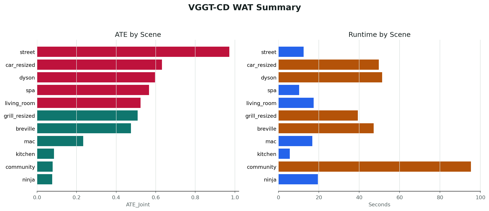

# VGGT-CD

[Project Page](https://sumu870.github.io/VGGT-CD/) | [Repository](https://github.com/sumu870/VGGT-CD)

VGGT-CD is a coarse-to-fine bi-temporal point cloud registration and change detection pipeline built on VGGT. It reconstructs two image sequences from different times, aligns them with a Sim(3) transformation, refines static correspondences, and exports pose evaluation results.



## Method

VGGT-CD addresses the coordinate and scale inconsistency between independently reconstructed T1/T2 image sequences.

1. VGGT reconstructs dense geometry, depth, confidence, and camera poses for T1 and T2.
2. A coarse cross-time Sim(3) transform is estimated from selected keyframes.
3. High-confidence dense points are filtered and aligned with the coarse transform.
4. Static correspondences are refined with voxel hashing and one-shot SVD.
5. The final alignment is saved as `fine_sim3.npz`.

## Repository Structure

```text
VGGT-CD/
├── run_inference.py               # Main VGGT-CD pipeline
├── run_inference.sh               # Shell wrapper for inference
├── coarse_to_fine_registration.py # Core coarse-to-fine registration method
├── IMPROVEMENTS.md                # Method details
├── app.py                         # Gradio demo entry
├── vggt/                          # VGGT model code
├── experiments/
│   ├── baselines/                 # Baseline methods
│   ├── evaluation/                # Evaluation scripts
│   └── results/summary.csv        # Experiment summary
├── docs/                          # GitHub Pages project site
└── requirements.txt
```

## Installation

```bash
git clone https://github.com/sumu870/VGGT-CD.git
cd VGGT-CD

python -m venv .venv
source .venv/bin/activate
pip install -r requirements.txt
```

Set the VGGT checkpoint path:

```bash
export VGGT_MODEL_PATH=/path/to/model.pt
```

## Data Format

```text
DATA_ROOT/
└── scene_name/
    ├── images/
    │   ├── SEQ_T1/
    │   └── SEQ_T2/
    └── sparse/0/
        ├── cameras.bin
        ├── images.bin
        └── points3D.bin
```

## Inference

```bash
python run_inference.py \
  --data_root /path/to/WAT \
  --scene breville \
  --seq_t1 IMG_9184 \
  --seq_t2 IMG_9185 \
  --output_root ./eval_results \
  --model_path "$VGGT_MODEL_PATH" \
  --num_keyframes 5 \
  --conf_threshold 50
```

Shell wrapper:

```bash
DATA_ROOT=/path/to/WAT \
SCENE=breville \
SEQ_T1=IMG_9184 \
SEQ_T2=IMG_9185 \
VGGT_MODEL_PATH=/path/to/model.pt \
./run_inference.sh
```

## Evaluation

```bash
python experiments/evaluation/eval_poses_1.py --eval_root ./eval_results
```

Scene outputs:

```text
eval_results/scene_name/
├── pred_poses_t1.npy
├── pred_poses_t2.npy
├── gt_poses_t1.npy
├── gt_poses_t2.npy
├── image_names_t1.txt
├── image_names_t2.txt
├── coarse_sim3.npz
├── fine_sim3.npz
└── timing.json
```

## Results

| Scenes | ATE mean | ATE RMSE | RTE mean | RRE mean | Time/scene | GPU memory |
| --- | ---: | ---: | ---: | ---: | ---: | ---: |
| 11 | 0.4316 | 0.4631 | 0.1933 | 0.3598 | 33.14 s | 18167.52 MB |

## Baselines

| Script | Method |
| --- | --- |
| `experiments/baselines/run_baseline_vggt_only.py` | Independent VGGT T1/T2 inference |
| `experiments/baselines/baseline_icp.py` | VGGT point clouds with ICP |
| `experiments/baselines/run_baseline_fgr.py` | VGGT point clouds with Fast Global Registration |
| `experiments/baselines/run_baseline_global_scale_icp.py` | Global scale alignment with ICP |
| `experiments/baselines/run_baseline_sim3_icp.py` | Sim(3) alignment with ICP |
| `experiments/baselines/run_baseline_geotransformer.py` | GeoTransformer baseline |

## Demo

```bash
GRADIO_SERVER_PORT=7860 python app.py
```
